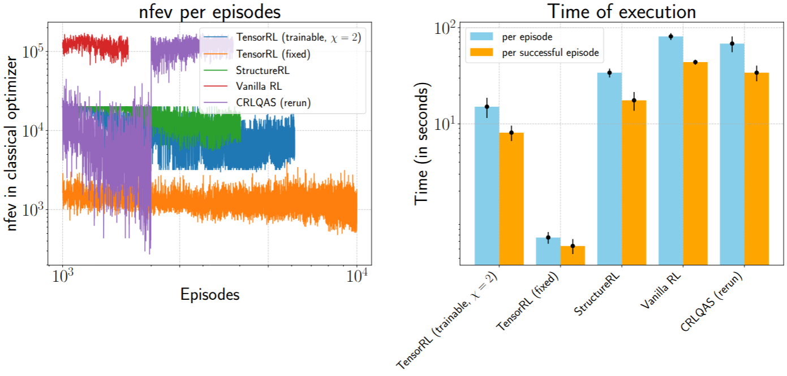

<div style="font-size: 20px;">

# TensorRL-QAS

                                                            ## NeurIPS-2025

## Improved and scalable up to 20-qubit quantum architecture search (QAS) within reinforcement learning (RL) framework with tensor networks (TNs)

## Problem statement
Automate the finding of hardware-effecient quantum circuits representing the eigenstate with lowest energy of a given Hamiltonian.

## Solution
Use **TensorRL-QAS**.


## Why TensorRL-QAS?

✅ At least **10-fold** fewer CNOTs and circuit depth,

✅ **98% training time reduction** per episdoe,

✅ **2.4-fold** reduced depth under noise,

✅ **Training stability** across random initialization of neural networks.

compared to **RL and non-RL based QAS** approaches. Moreover,

✅ Pure **CPU based training** up to 8-qubit

✅ **Easily scalable to large quantum systems**


## The dependencies
```
conda create -n {name_your_environment} python=3.10
conda activate {name_your_environment}
pip install -r requirements.txt
```

## Running TensorRL-QAS

There are a total of two steps one need to follow to successfully execule **TensorRL-QAS**


- ###  Matrix produce state (MPS) generation then conversion to parametrized quantum circuit (PQC)
    **Run**
    ```
    python3 dmrg-to-qc/dmrg_to_qc.py
    ```
    The python script `dmrg_to_qc.py` uses density matrix renormalization group (DMRG) where it takes the Hamiltonian as input, then finds an MPS to approximate the ground state. The it maps the MPS to a PQC depending on the user provided **bond dimension** ($\chi$) of the MPS and the **number of layers**

    After executing the code will ask the user to input a number where each number belongs to the different molecular Hamiltonian and the Hamiltonian corresponding to the Heisenberg model. Then you will be asked to provide the **bond dimension** ($\chi$) of the MPS and the **number of layers** of the PQC generated using the MPS with user provided $\chi$.

    - **mol_data/** contains all the molecules utilized in benchmarking TensorRL-QAS. 
    - **init_state_circ/** contains the **MPS -> PQC** converted circuits and the states of the MPS.
    - **mps2qc.py**, **stiefel_opt.py** and **tnqc_ansatze.py** represents the *MPS -> PQC*, *Riemannina optimization* and *Brickwork structure* which are the primary subroutines of `dmrg_to_qc.py`.

- ### QAS utilizing TensorRL

    - To train QAS utilizing **TensorRL (trainable) on noiseless scenario** run the following:
    ```
    python3 Tensor_training_and_structureRL_noiseless.py --seed {seed} --config {config} --experiment_name "TensorRL_trainable/"
    ```

    - To train QAS utilizing **TensorRL (fixed) on noiseless scenario** run the following:
    ```
    python3 TensorRL_fixed_noiseless.py --seed {seed} --config {config} --experiment_name "TensorRL_fixed/"
    ```


    - To train QAS utilizing **StructureRL on noiseless scenario** run the following:
    ```
    python3 Tensor_training_and_structureRL_noiseless.py --seed {seed} --config {config} --experiment_name "structureRL/"
    ```


Where `seed` defines the random initialization fo the weights and biases of the neural network and `config` is the `configuration` in `configuration_files/` folder.


     
## Baseline QAS approaches
Here we provide the source code for the baseline approaches we compare **TensorRL-QAS** for benchamrking.

- **CRLQAS:** The code for CRLQAS implementation can be found at: https://anonymous.4open.science/r/CRLQAS/

- **SA-QAS:** The code for SA-QAS can be found at: https://github.com/Lucky-Lance/QAS-Bench/tree/main

- **RA-QAS:** The code for RA-QAS can be found at: https://github.com/iitis/RL_for_VQSD_ansatz_optimization

- **Vanilla RL:** The code for Vanilla RL can be found at: https://github.com/mostaszewski314/RL_for_optimization_of_VQE_circuit_architectures/tree/main

- **quantumDARTS:** We could not find any open repository so we compare with the results provided in the paper: https://openreview.net/forum?id=jGYxcXSg8C

- **TF-QAS:** We could not find any open repository so we compare with the results provided in the paper: https://ojs.aaai.org/index.php/AAAI/article/view/29135


## The benchmark


## 98% computation time reduction!



## Training 8-qubit (Water) molecule on CPU!

